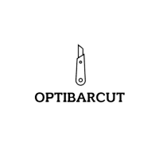

  

# English [here](https://github.com/GeoHolz/OptiBarCut/blob/main/README-EN.md)

# Original project
Forked from https://github.com/emadehsan/csp

# Change
- Interface graphique aec PySimpleGUI
- Ajout d'un délais maximum de calcul de 120s afin d'éviter les calculs impossible ou trop long

# OptiBarCut

OptiBarCut est un programme permetant d'optimiser les chuttes lors de découpe.
Utilise OR-Tools de Google

  

## Installation

Installer les dépendances ( requirements.txt ) et executer OptiBarCut.py
Pour les utilisateurs Windows, un binaire est disponible dans la section [Release](https://github.com/GeoHolz/OptiBarCut/releases)

v
## Resources
Tout le code logique de découpe est copié :
* [Practical Python AI Projects: Mathematical Models of Optimization Problems with Google OR-Tools](https://amzn.to/3iPceJD)
* [Repository of the code in Serge's book](https://github.com/sgkruk/Apress-AI/)

## License

[MIT](https://choosealicense.com/licenses/mit/)